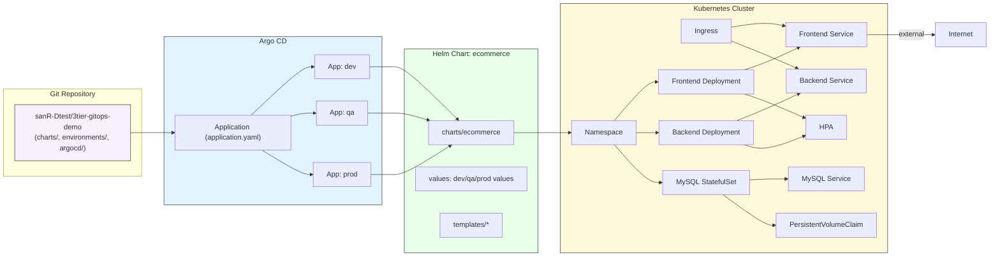

## Architecture diagram

Brief: Git repo holds the Helm chart and environment values; Argo CD syncs `application.yaml` to create environment-specific apps (dev/qa/prod) which deploy the `ecommerce` chart into namespaces. The chart provisions frontend/backend Deployments + Services, a MySQL StatefulSet + PVC, an Ingress, and HPAs.
